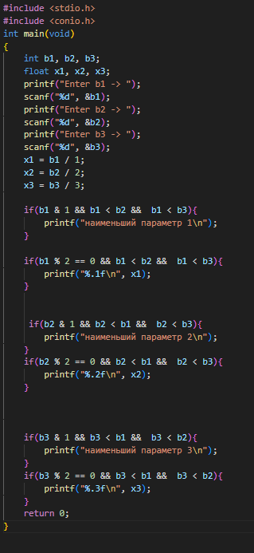
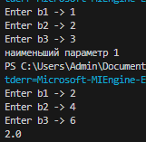

# proga
## отчёт по лабораторной 1 Вариант 6
### Задание
Сложность:
Rare
1 Разберите код программы из примера.

2 Составьте блок-схему алгоритма для своего варианта.

3 Напишите программу, решающую задачу по своему варианту.

4 Оформите отчёт в README.md. 

# Ход работы
##1. Разберите код программы из примера.

## 2. Составьте блок-схему алгоритма для своего варианта.

## 3. Напишите программу, решающую задачу по своему варианту.
###Задание которое надо решить
### моя программа

### Результат моей программы

#####
ссылки на используемые материалы

1.https://evil-teacher.on.fleek.co/prog_pm/lab01/

2.https://programforyou.ru/block-diagram-redactor

3.https://github.com/Yoriichi2222/proga

4.https://www.youtube.com/watch?v=QvtYaUUo4nI&t=419s

5.https://www.youtube.com/watch?v=Zpml91CY8jY&t=462s

6.https://www.youtube.com/watch?v=C_Py3IgRxSk&t=535s

7.https://learn.microsoft.com/ru-ru/cpp/c-language/c-logical-operators?view=msvc-170

8.https://otvet.mail.ru/question/193942185
