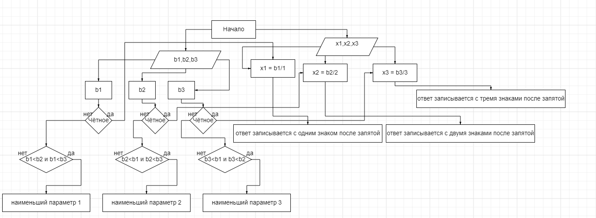
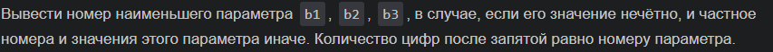
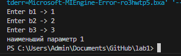
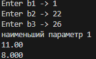

# proga
## отчёт по лабораторной 1 Вариант 6
### Задание
Сложность:
Rare
1 Разберите код программы из примера.

2 Составьте блок-схему алгоритма для своего варианта.

3 Напишите программу, решающую задачу по своему варианту.

4 Оформите отчёт в README.md. 

# Ход работы
##1. Разберите код программы из примера.

```
#include <stdio.h>
#include <math.h>

int main()
{
    float a, b, c;
    printf("Enter a -> ");
    scanf("%f", &a);
    printf("Enter b -> ");
    scanf("%f", &b);
    printf("Enter c -> ");
    scanf("%f", &c);

    if (!a && !b && !c)
        return 0;

    float x = 1.0f;
    printf("f(x) = ");
    if (a)
    {
        printf("%f * x^2 ", a);
        if (b > 0.0f)
            printf("+ ");
    }
    if (b)
        printf("%f * x ", b);
    if (c)
    {
        if (c > 0.0f)
            if (a || b)
                printf("+ ");
            else
                printf("- ");
        printf("%f", fabs(c));
    }
    printf("\n");

    float f_x = a * x * x + b * x + c;
    float f_minus_x = a * -x * -x + b * -x + c;
    if (f_x == f_minus_x)
        printf("Function is even: f(x) = %f = f(-x) = %f\n", f_x, f_minus_x);
    else if (f_minus_x == -f_x)
        printf("Function is odd: f(-x) = %f = -f(x) = %f\n", f_minus_x, -f_x);
    else
        printf ("Function is neither even nor odd: \
            f(x) = %f != f(-x) = % f != -f(x) = %f\n" , f_x , f_minus_x , -f_x);

    if (a)
    {
        float vx = -b / (2.0f * a);
        float vy = a * vx * vx + b * vx + c;
        printf("Vertex (%f, %f) is a ", vx, vy);
        if (a > 0.0f)
            printf("minimum");
        else
            printf("maximum");
        printf("\n");
    }
    return 0;
}
```
## 2. Составьте блок-схему алгоритма для своего варианта.


## 3. Напишите программу, решающую задачу по своему варианту.
###Задание которое надо решить
### моя программа

### Результат моей програмы

#####
ссылки на используемые материалы
1.https://evil-teacher.on.fleek.co/prog_pm/lab01/
2.https://programforyou.ru/block-diagram-redactor
3.https://github.com/Yoriichi2222/proga
4.https://www.youtube.com/watch?v=QvtYaUUo4nI&t=419s
5.https://www.youtube.com/watch?v=Zpml91CY8jY&t=462s
6.https://www.youtube.com/watch?v=C_Py3IgRxSk&t=535s
7.https://learn.microsoft.com/ru-ru/cpp/c-language/c-logical-operators?view=msvc-170
8.https://otvet.mail.ru/question/193942185
